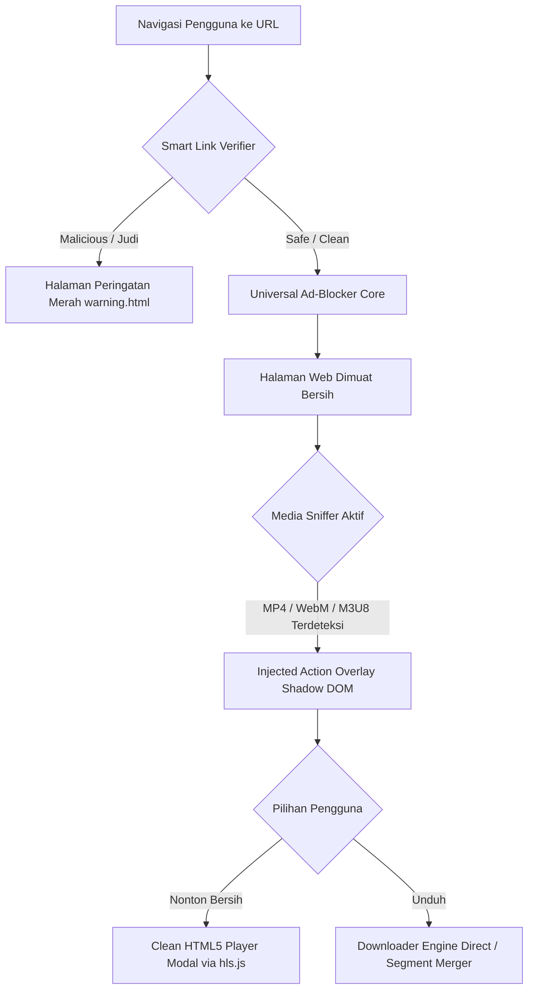
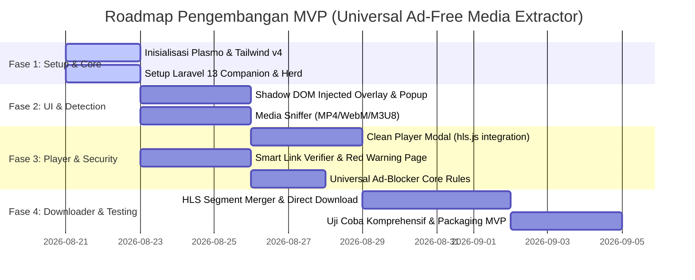

# Master PRD: Universal Ad-Free Media Extractor
**Versi:** 1.1 (Production-Ready Refined)  
**Tipe Dokumen:** Product Requirements Document (PRD) & Technical Architecture  
**Target Rilis:** MVP v1.0.0  

---

## 1. Ringkasan Eksekutif & Konteks Bisnis

* **Nama Produk:** Universal Ad-Free Media Extractor
* **Tujuan Produk:** Menyediakan ekstensi peramban (*browser extension*) all-in-one yang mengamankan pengguna dari tautan berbahaya/judi, menghilangkan iklan intrusif dan pop-under, serta memungkinkan pemutaran bersih dan pengunduhan media video lintas platform.
* **Proposisi Nilai:** Menghilangkan keharusan pengguna awam memasang banyak ekstensi (pemblokir iklan, antivirus tautan, dan pengunduh video) dengan menggabungkannya ke dalam satu alur kerja yang mulus, ringan, dan privasi-terjaga.
* **Target Audiens:** Pengguna internet harian yang mengonsumsi konten media dari berbagai sumber eksternal dan rentan terhadap jebakan klik (*click-bait*), phishing, atau iklan berbahaya.
* **Metrik Kesuksesan MVP:**
  1. Ekstensi berjalan stabil di browser berbasis Chromium (Chrome, Edge, Brave).
  2. Berhasil mendeteksi dan mencegat akses ke URL berbahaya/judi uji coba.
  3. Berhasil mengekstrak media (MP4, WebM, M3U8) dan memutarnya pada modal HTML5 bersih tanpa pop-up.
  4. Penggunaan memori stabil di bawah 40 MB.

---

## 2. Cakupan Platform & Arsitektur Antarmuka (UI/UX)

### 2.1. Platform Target
* **Primary:** Peramban berbasis Chromium (Google Chrome, Microsoft Edge, Brave, Opera, Vivaldi) dengan standar **Manifest V3**.

### 2.2. Antarmuka Pengguna (UI)
Antarmuka dibangun menggunakan **Tailwind CSS v4** dan terbagi menjadi 3 komponen utama:

1. **Extension Popup Panel (Browser Action):**
   * Panel ringkas saat ikon ekstensi di toolbar diklik.
   * Menampilkan:
     - Status keamanan domain aktif (Aman / Waspada / Diblokir).
     - Jumlah iklan/tracker yang telah dibersihkan pada halaman tersebut.
     - Daftar media yang berhasil terdeteksi di tab aktif beserta tombol aksi cepat (*"Play Clean"* / *"Download"*).
     - Tombol toggle untuk mengaktifkan/menonaktifkan proteksi per domain (*Whitelisting*).

2. **Injected Action Overlay (Floating Widget):**
   * Disuntikkan secara dinamis (*DOM Content Script*) pada sudut kanan bawah atau di dekat elemen `<video>` yang terdeteksi.
   * Menggunakan **Shadow DOM** (`plasmo:csui` dengan mode Shadow Root) untuk memastikan CSS Tailwind v4 terisolasi 100% dan tidak terdistorsi oleh stylesheet bawaan situs web host.
   * Menyediakan tombol aksi cepat: *"Nonton Bersih (Clean Player)"* dan *"Unduh Video"*.

3. **Clean Player Modal & Red Warning Page:**
   * **Clean Player Modal:** Modal pemutar video mandiri (HTML5 native + `hls.js`) dengan kontrol kustom minimalis (Play/Pause, Volume, Fullscreen, Speed, Download).
   * **Red Warning Interstitial Page (`warning.html`):** Halaman internal ekstensi dengan latar belakang merah kontras yang muncul jika pengguna menuju link berbahaya/judi, menyajikan informasi ancaman dan tombol kembali ke halaman aman.

---

## 3. Spesifikasi Fitur Minimum Viable Product (MVP)



### 3.1. Modul 1: Smart Link Verifier
* **Fungsi:** Mencegat navigasi jaringan sebelum halaman dibuka, memeriksa reputasi URL, dan memblokir situs phishing/malware/judi.
* **Alur Logika:**
  1. Event `chrome.webNavigation.onBeforeNavigate` menangkap URL target.
  2. Pengecekan awal ke *Local Fast-Cache* (IndexedDB / `chrome.storage.local`).
  3. Jika data tidak ada di cache, kirim query ke backend companion Laravel (`POST /api/v1/verify-link`).
  4. Jika URL masuk daftar hitam (*blacklist*), lakukan *redirect* internal ke `chrome-extension://<id>/warning.html?url=<encoded_url>&threat=<threat_type>`.

### 3.2. Modul 2: Universal Ad-Blocker Core
* **Fungsi:** Menghilangkan iklan, pop-under, dan overlay klik tembus pandang (*clickjacking layer*).
* **Alur Logika:**
  1. **Network Layer:** Aturan statis `chrome.declarativeNetRequest` memblokir domain iklan dan script tracker populer (berbasis EasyList & Peter Lowe's Blocklist).
  2. **Cosmetic DOM Layer:** Content script menyuntikkan aturan CSS pembersihan elemen dan secara proaktif menghapus elemen `div` transparan berpola `z-index: 999999` yang sering dipakai situs streaming untuk memicu pop-up saat area video diklik.

### 3.3. Modul 3: Media Sniffer (Network Interceptor)
* **Fungsi:** Menangkap URL asli media streaming yang dimuat situs web.
* **Alur Logika:**
  1. Service Worker mendengarkan event jaringan `chrome.webRequest.onHeadersReceived` (observational mode).
  2. Mendeteksi lalu lintas dengan header:
     - `Content-Type: video/mp4`, `video/webm`, `application/x-mpegURL`, `application/vnd.apple.mpegurl`.
     - Atau URL yang mengandung ekstensi `.mp4`, `.webm`, `.m3u8` (sebelum query string).
  3. Mengabaikan file video dengan durasi sangat pendek (< 5 detik) atau file video iklan pelacak.
  4. Menyimpan daftar URL media aktif pada memori sesi tab dan mengirimkan notifikasi ke Content Script tab terkait.

### 3.4. Modul 4: Clean Player & Downloader Engine
* **Fungsi:** Menyajikan pemutar media bersih dan mekanisme pengunduhan file video.
* **Alur Logika:**
  1. **Pemutar Bersih:**
     - Berkas MP4/WebM diputar langsung menggunakan tag `<video>` HTML5 standar.
     - Berkas `.m3u8` di-streaming menggunakan pustaka **`hls.js`** yang disematkan di dalam extension bundle.
  2. **Pengunduh Berkas:**
     - **Tipe Direct MP4/WebM:** Memanggil API `chrome.downloads.download({ url: mediaUrl, filename: suggestedTitle })`.
     - **Tipe Streaming M3U8 (HLS):** Mengunduh berkas playlist `.m3u8`, mengunduh seluruh segmen `.ts` secara asinkron dengan progress bar, lalu menggabungkannya (*transmuxing*) menjadi berkas `.mp4` tunggal menggunakan pustaka `mux.js` / Web Streams API sebelum disimpan ke disk.

---

## 4. Penanganan Edge Cases & Keamanan

| Skenario / Kasus Khusus | Risiko | Solusi & Penanganan |
| :--- | :--- | :--- |
| **Konten Terproteksi DRM (Widevine / FairPlay)** | Ekstraksi gagal dan file terenkripsi | Ekstensi mendeteksi skema DRM (MIME `application/dash+xml` dengan tag ContentProtection) dan menampilkan info: *"Konten ini dilindungi hak cipta DRM dan tidak dapat diekstrak"*. |
| **CORS Restriction saat Download** | Browser memblokir fetch stream video | Request dialihkan ke endpoint backend proxy Laravel (`POST /api/v1/proxy-media`) untuk mengambil stream dengan header yang sesuai. |
| **Deteksi Anti-Adblock pada Situs Host** | Situs memblokir pemutaran video jika adblocker aktif | Content script bertindak pasif (tidak memanipulasi variabel global window) dan hanya mengisolasi stream video asli ke Clean Player. |
| **Kebijakan Chrome Web Store (YouTube Policy)** | Ekstensi ditolak di CWS jika mengunduh video YouTube | Menambahkan *URL match pattern exclusion* untuk domain `*://*.youtube.com/*` khusus untuk rilis CWS. |

---

## 5. Arsitektur Teknis & Tech Stack

### 5.1. Extension Client Stack
* **Framework:** [Plasmo Framework](https://docs.plasmo.com/) (Manifest V3 Standard).
* **Bahasa & Runtime:** TypeScript / React 18+.
* **Styling:** Tailwind CSS v4.1 (Scoped via Shadow DOM CSUI).
* **Media & Stream Engine:** `hls.js` (HLS playback) & `mux.js` (TS to MP4 segment merger).
* **Penyimpanan Lokal:** `chrome.storage.local` untuk konfigurasi preferensi & whitelist domain.

### 5.2. Web Companion / Proxy API (Laravel 13)
* **Framework:** Laravel 13 (PHP 8.3+).
* **Lingkungan Pengembangan:** Laravel Herd on Windows (zero-config local domain & SSL).
* **Arsitektur Backend:** Stateless REST API (tanpa autentikasi pengguna, rate-limited by client IP).

### 5.3. Spesifikasi Endpoint REST API Backend

#### 1. Verifikasi Keamanan URL
* **Route:** `POST /api/v1/verify-link`
* **Request Header:** `Content-Type: application/json`
* **Request Body:**
  ```json
  {
    "url": "https://example-streaming-site.com/watch?v=123"
  }
  ```
* **Response Body:**
  ```json
  {
    "status": "success",
    "data": {
      "url": "https://example-streaming-site.com/watch?v=123",
      "domain": "example-streaming-site.com",
      "is_safe": true,
      "threat_category": null, // "phishing" | "malware" | "gambling" | null
      "risk_score": 0
    }
  }
  ```

#### 2. Media Proxy Stream (Fallback CORS)
* **Route:** `POST /api/v1/proxy-media`
* **Request Body:**
  ```json
  {
    "media_url": "https://cdn.example.com/video/stream.m3u8",
    "referer": "https://example-streaming-site.com/"
  }
  ```
* **Response:** Stream data binary dengan header `Access-Control-Allow-Origin: *`.

#### 3. Sinkronisasi Blocklist Rules
* **Route:** `GET /api/v1/rules/blocklist`
* **Response:** Array aturan deklaratif terkompilasi untuk update dinamis `chrome.declarativeNetRequest`.

---

## 6. Kebutuhan Non-Fungsional (NFR)

* **Performance & Speed:** Waktu verifikasi URL melalui cache < 5ms, melalui API < 200ms. Latensi penangkapan media < 300ms setelah request terkirim.
* **Resource Consumption:** Konsumsi memori background service worker < 25 MB saat idle, < 50 MB saat proses transmuxing video stream.
* **Privacy & Compliance:** Tidak ada pencatatan (*zero-logging*) riwayat penjelajahan pengguna di server backend. Mematuhi prinsip GDPR & regulasi privasi data.
* **Reliability:** Seluruh operasi asynchronous menggunakan error boundary untuk mencegah crash pada browser pengguna.

---

## 7. Roadmap Implementasi


